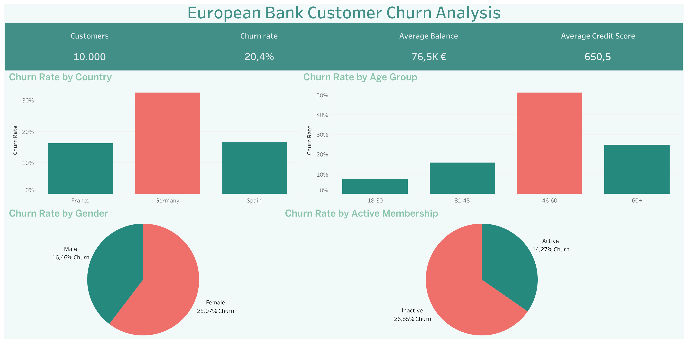

# Bank Customer Churn Analysis

## Project Overview

This project analyzes customer churn behavior for a European bank using Python, SQL, and Tableau.

The goal is to identify the main factors influencing customer attrition and provide business insights that can help improve customer retention strategies.

---

## Business Questions

This analysis aims to answer the following questions:

- Which country has the highest churn rate?
- Which age groups are more likely to leave the bank?
- Does customer activity influence churn?
- Are there differences in churn behavior between genders?
- What are the overall customer and financial KPIs?

---

## Tools & Technologies

- Python
  - Pandas
  - NumPy
  - Matplotlib
  - Seaborn
- SQL
- Tableau
- Jupyter Notebook

---

## Project Structure

```text
Bank-Customer-Churn-Analysis/
│
├── data_raw/
│   └── original dataset
│
├── data_cleaned/
│   └── cleaned dataset
│
├── notebook/
│   └── data cleaning and exploratory analysis
│
├── sql/
│   └── KPI and churn analysis queries
│
├── dashboard/
│   └── Tableau dashboard preview
│
└── README.md
```

---

## Key Insights

### Churn by Country
- Germany shows the highest churn rate among the analyzed countries.
- France and Spain present significantly lower churn levels.

### Churn by Age Group
- Customers aged 46–60 exhibit the highest churn rate.
- Younger customers show considerably lower attrition.

### Churn by Membership Activity
- Inactive customers are substantially more likely to churn than active members.

### Churn by Gender
- Female customers display a higher churn rate compared to male customers.

---

## Dashboard Preview



---

## Interactive Dashboard

View the Tableau Public dashboard here:


🔗 https://public.tableau.com/views/Cartella1_17822324111230/Dashboard1?:language=it-IT&:sid=&:redirect=auth&:display_count=n&:origin=viz_share_link

---

## Project Outcome

The analysis highlights that customer activity level, age, and geographic location are among the strongest indicators of churn risk.

These findings can support targeted retention campaigns and customer engagement strategies.
